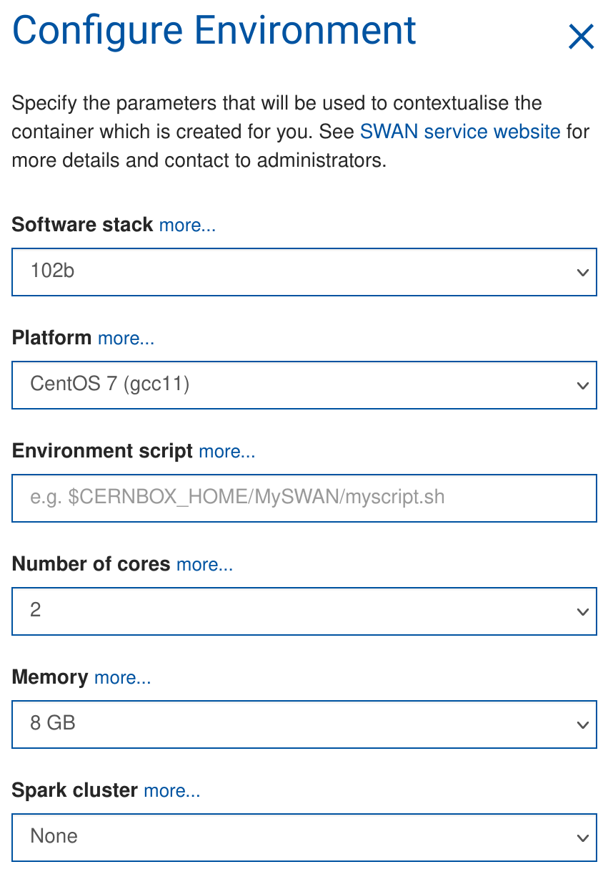

# O2AT - Second edition - Machine Learning primer

Welcome to the O2AT ML tutorial. Today we will have a look at how to train Boosted Decision Trees (BDTs) and Shallow Neural Networks (NN) in Python and how to use them in O2Physics analyses.

Before we start some preliminary steps are needed. Follow them heareafter!

## SWAN setup

We will run this tutorial on CERN SWAN, so click here

[](https://cern.ch/swanserver/cgi-bin/go?projurl=https://github.com/AliceO2Group/analysis-tutorials.git)

to go to SWAN and automatically download this repository.

To have the right environment configure SWAN in this way:

- **Software stack**: 102b
- **Environment script**: /eos/user/a/alicesk/O2AT_ML/setup.sh

You should have this setup



## Tutorials

The tutorials will be given using [Jupiter](https://jupyter.org/) Notebooks.

### BDT classification

For this tutorial open the `dummy.ipynb` notebook in the folder `analysis-tutorials/o2at-2/machineLearning/BDTClassification`.

### Neural network regression

For this tutorial open the `NeuralNetworks.ipynb` notebook in the folder `analysis-tutorials/o2at-2/machineLearning/NeuralNetworkRegression`.

---

## "Power-user" setup

If you feel expert enough and you want to run the tutorials on your PC, the following instructions will help you to setup the needed Python environment and to launch the Jupiter notebooks. These instructions are also helpful in case you would like to start you ML project.

1. Clone this repository

```bash
git clone https://github.com/AliceO2Group/analysis-tutorials.git
```

2. Create a Python environment in your home directory

```bash
python3 -m venv ~/.virtualenvs/O2AT2_ML
```

3. Activate the Python environment (you will have to do it each time you want to run this code)

```bash
source ~/.virtualenvs/O2AT2_ML/bin/activate
```

4. Install the required packages (it could take some time depending on your connection)

```bash
pip3 install --upgrade pip setuptools
pip3 install notebook hipe4ml torch onnx onnxruntime mplhep
```

5. Lauch the Jupyter server (from the tutorial repository folder)

```bash
cd *your_tutorial_repository_folder*
jupyter notebook
```

A tab in your browser should now open.
