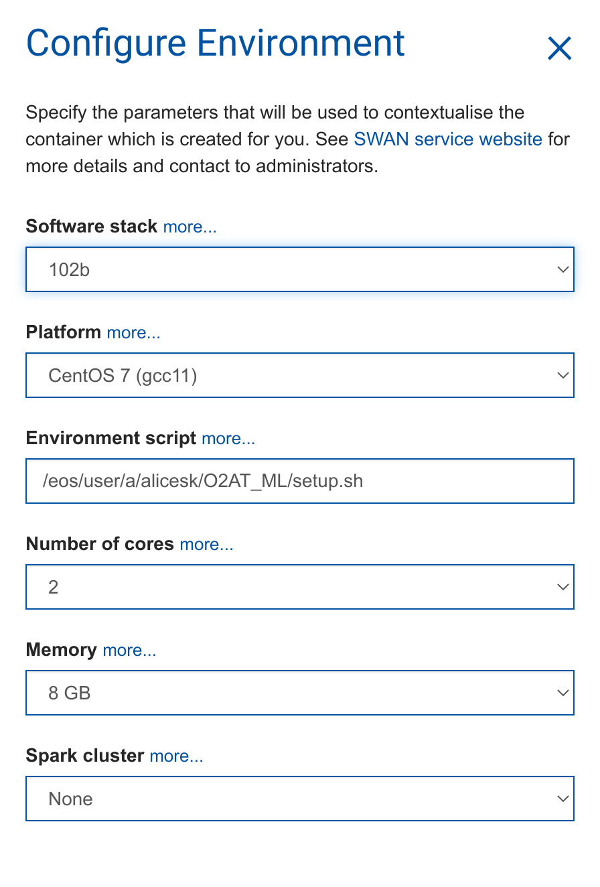

# O2AT - Second edition - Machine Learning primer

Welcome to the O2AT ML tutorial. Today we will have a look at how to train Boosted Decision Trees (BDTs) and Shallow Neural Networks (NN) in Python and how to use them in O2Physics analyses.

Before we start some preliminary steps are needed. Follow them heareafter!

## SWAN setup

We will run this tutorial on CERN SWAN, so click here

to go to SWAN and automatically download this repository.

We will use the default configuration, so you should have this setup

## Tutorials

The tutorials will be given using [Jupiter](https://jupyter.org/) Notebooks.

### BDT classification

For this tutorial open the `dummy.ipynb` notebook in the folder `BDTClassification`.

### Neural network regression

For this tutorial open the `NeuralNetworks.ipynb` notebook in the folder `NeuralNetworkRegression`.
