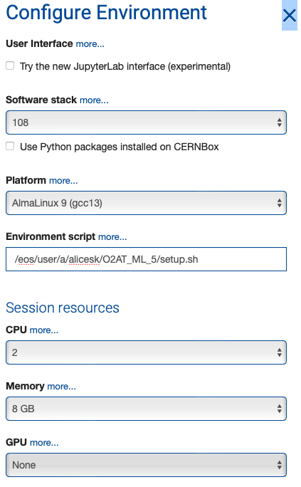

# O2AT - Fifth edition - Machine Learning primer

Welcome to the O2AT ML tutorial. Today we will have a look at how to train Boosted Decision Trees (BDTs) in Python and how to export and use a ML model in O2Physics analyses.

Before we start some preliminary steps are needed. Follow them hereafter!

## SWAN setup

We will run the BDT training part of this tutorial on CERN SWAN, so click here

[](https://cern.ch/swanserver/cgi-bin/go?projurl=https://github.com/AliceO2Group/analysis-tutorials.git)

to go to SWAN and automatically download this repository.

To have the right environment configure SWAN in this way:

- **Software stack**: 108
- **Environment script**: /eos/user/a/alicesk/O2AT_ML_5/setup.sh

You should have this setup



## Tutorials

### BDT classification

This tutorial will be given using [Jupyter](https://jupyter.org/) Notebooks. Open the `DsBDTrun3.ipynb` notebook in the folder `analysis-tutorials/o2at-5/machineLearning/MlClassification`.

### Inference in O2Physics

For this tutorial you need to compile and run code on your laptop. You will find the skeleton task `applyMlSelection.cxx` in the folder `Tutorials/ML` of your clone of the O2Physics repository, together with a JSON configuration file `config.json` and a script to run the analysis workflow `run_applyMlSelection.sh`.

You need also some data to test the inference task. To download the AO2D file necessary, you can use the following command
```bash
curl -L https://cernbox.cern.ch/s/TrKZed4hzNI5RDL/download --output AO2D_MC_Ds.root
```
It will take some time to complete.
To run the analysis, you will have to specify the path to the `AO2D_MC_Ds.root` file in the running script (`run_applyMlSelection.sh`).
---

## "Power-user" setup

If you feel experienced enough and you want to run the tutorials on your PC, the following instructions will help you to setup the needed Python environment and to launch the Jupyter notebooks. These instructions are also helpful in case you would like to start your ML project.

1. Clone this repository

```bash
git clone https://github.com/AliceO2Group/analysis-tutorials.git
```

2. Create a Python environment in your home directory

```bash
python3 -m venv ~/.virtualenvs/O2AT5_ML
```

3. Activate the Python environment (you will have to do it each time you want to run this code)

```bash
source ~/.virtualenvs/O2AT5_ML/bin/activate
```

4. Install the required packages (it could take some time depending on your connection)

```bash
pip3 install --upgrade pip setuptools
pip3 install notebook hipe4ml onnxmltools==1.12.0 onnxconverter-common==1.16.0
```

5. Lauch the Jupyter server (from the tutorial repository folder)

```bash
jupyter notebook
```
